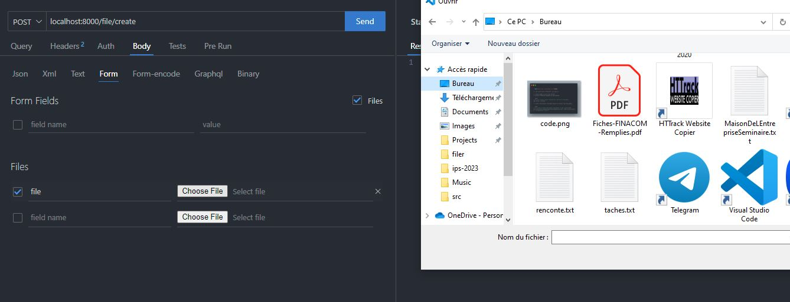

###  Project : File manager using TOTALJS
  
  
- ### [Introduction]( )
  
Document management applications are essential tools for businesses and organizations to efficiently manage their documents, files, and data. Total.js is a popular web application framework that offers a range of features and tools to build robust and scalable applications.
  
In this tutorial blog post, we will guide you through the process of building a document management application using Total.js. We will cover the basics of setting up Total.js, designing the database schema, building the RESTful API, implementing file upload, download and remove functionalities.
  
By the end of this tutorial, you will have a solid understanding of how to build a document management application using Total.js, which you can then customize and adapt to your specific needs.
So, let's get started! 🚀
  
---
  
- #### [What is **TotalJs** and Why ?]( )
  
[**TotalJs**](https://docs.totaljs.com/welcome ) is an open-source web application framework for Node.js that follows the Model-View-Controller (MVC) architecture pattern. It offers a range of features, such as server-side rendering, real-time communication, and RESTful routing, that allow developers to create scalable and efficient web applications. With a modular architecture, Total.js enables developers to build applications in a modular way, making it easier to maintain and scale their codebase. It also supports real-time communication using WebSockets, making it suitable for developing real-time applications. Total.js is flexible, allowing developers to customize the framework to their specific needs. Additionally, Total.js provides extensive documentation, making it easy for developers to get started and learn the framework. Overall, Total.js is an excellent choice for building modern, scalable, and efficient web applications with Node.js.
  
- #### [How to set a new project up ?]( )
  
Before we start building our document management application, we need to set up Total.js. Here's how you can do it:
  
1. install [nodejs](https://nodejs.org/en/download/ ) on your local machine
2. create an empty folder
  
```bash
# This will create a folder named filer
mkdir filer
```
  
3. initialize the npm package.json boilerplate
  
```bash
# This initiate npm package.json file 
cd filer && npm init -y
```
  
- #### [Launch your first project]( )
  
After boilerplating your project, you can now launch it:
  
  1. install required dependencies:
  
```bash
npm install total4
# this is all the dependencies we need right now
```
  
 2. launch the sever
  
   ```bash
   # we create a file named index.js and we require total4 in the file, that will served on port 3000
   echo "require('total4/debug')({port: 3000})" >> index.js
   # We launch the server now
   node ./index.js
   ```
  
3. create the views to get feedbacks from your webbrowser
   - In the root of your project, create a folder named `views` and inside this folder create two files, one named `layout.html` and another named `index.html`. In the `layout.html` file, you just need to boilerplate the html basic stuff of meta, link and so on. In the head tag, you can also include the following code ``@{import('meta', 'head')}``. In the body tag, you need to inlude the following code. `@{body}`. After that, you just need to add some content you want in the `index.html` file
   - create the route for the root of the project. To do so, create a folder in the root of your project and name it `controllers`. In this controllers folder, create a file named `files.js`, and place the following code inside the new created file
  
  ```js
    // This is the route for the root of the project
    exports.install = () => {
      ROUTE('GET /');
    };
  ```
  
|   views/`layout.html` code |  views/`index.html` code |
|:--: |--- |
|    |    |
  
4. open your browser and navigate to `http://localhost:3000/`
  
| controllers/`files.js`| outpout of the code|
|---|---|
|||
|You can read more about route in the [docs](https://docs.totaljs.com/total4/40d57002oi50c/ )|👏 Congratulations. You just launched your first project.|
  
- #### [Project Structure]( )
  
Now let's explain how all these bunch of files and folders mean.
  
######  Here's the project structure
  
  
```bash
├── controllers
│   └── files.js
├── node_modules
├── public
│   ├── downloads
├── tmp
│   └── 
├── views
│   └── layout.html
│   └── index.html
├── index.js
├── index.js.json
├── index.pid
├── package.json
├── package-lock.json
```
  
- the `controllers` folder represent the `C` part of the `MVC` architecture. In this folder we'll be defining routes and code logic. For those who already know *Laravel*, this folder is equivalant to the `routes` and the `App\Http\Controllers\` folders. See how things are easier in TotalJs 🙂
- the `public` folder is used to store static files such `.css`, `.js`, `image` files, etc. In this folder, we will store our uplaoded files.
- the `tmp` folder is for storing temporary files. We don't need it at this stage.
- the `views` folder will contain all the views, `.html` of the project. This folder represent the `V` in the `MVC` architecture
- among the other files, `index.js`, is the entry point of any totaljs project, and is one of the most import file
- along with these folders, there are some folders that can be added, such `schemas`, `databases` while building a complex project. We will add some folders when we'll need to perform certain operations
  
>**Note 📝**
> In this template, we do not see the `M` part of the `MVC`. Normally, it's represented by a folder named `schemas`. We will add this folder when building schemas
  
- #### [Building the backend]( )
  
> **Good to know 👓**
> A schema, is what we useally call model in other framework like in Laravel, Django and so on
  
The backend of our document management application will handle the data storage, retrieval, as well as the removal logic.
  
Now, let's start the fun part :surfing_man:
  
1. **Designing the database schema:**
  
  > **Note 📝**
  > It's not mandatory to create the schema for this project, but because we want to explore much about the framework, we will use schemas
  
First, we need to design the database schema for our application. For this purpose we will create a folder named `schemas` at the root of our porject and inside it create a file named `files.js`
  
```bash
mkdir schemas && touch ./schemas/files.js
# now the MVC architecture is complete since we created the schemas folder
```
  
2. **Creating the database**
We will be using nosql as our database, which is a best database format for our usecase, as explained in the totalJs docs. For this purpose, create a folder named `databases` and inside that folder create a file named `files.nosql`. The nosql is a sql like file. It will hold every entry representing a file uploaded informations as a object.
  
```bash
mkdir databases && touch ./databases/files.nosql
```
  
Now, let's start coding. Open the `files.js` file and add the following code
  
```js
// schemas/files.js
NEWSCHEMA('File', function(schema) {
schema.define('f_name', 'String(64)');
schema.define('f_extension', 'String(8)');
schema.define('f_path', 'String(128)');
schema.define('f_size', 'String(64)');
  
```
  
This will create a `schema` *like a model in Laravel* named `File`  that has fields `f_name, f_extension, f_path, f_size`. These fields are all of type string _(`varchar` under some other conventions)_ .
Now let's add some actions to the schema, so that we can perform some queries.
  
Now we define the action for getting all the files.
  
```js
...
// update the above code and add the following code just bellow the last definition of the schemas
 schema.action('query', {
  // The action param is the function that need to be called when the method is called
  action: function($) {
    // we declare a variable db that will hold the database
   var db = DB().find('nosql/files');
    // we define the fields that we want to get from the database
   db.fields('id,f_name,f_extension,f_path,f_size,dtcreated');
    // we sort the entries by the date
   db.sort('dtcreated_desc');
    // we return a callback that holds all the retreived entries
   db.callback($.callback);
  }
 });
```
  
Now let's define the action for storing a uploaded file
  
```js
...
// update the above code and add the following code just bellow the last action of the schema
 schema.action('create', {
  action: async function($, model) {
    var file = $files[0]
  // we set the file name to the name of the file
   model.f_name = file.filename;
  //  we let each entry have a random entry ID
   model.id = UID();
  //  we set the file uploaded time to the current date
   model.dtcreated = NOW;
  //  we define the file extension to be the one we've uploaded
   model.f_extension = file.f_extension;
  //  we retreive get the size of the file and set it also as the f_extension value
   model.f_size = file.f_size;
  //  we set the path of the file to be in the public/downloads/file_name.extension
 model.f_path = PATH.public(`/downloads/${file.filename}`);
//  we insert the uploaded file informations in the database
await DB().insert('nosql/files', model).promise($);
//  after that we try to get the file content and save it in the public folder of our current directory
   await F.Fs.readFile(file.path, function (error, content) {
    if (error) { $.invalid(error); return; }
    F.Fs.writeFile(PATH.public(`/downloads/${file.filename}`), content, function () { 
      $.success()
    })
   });
  
 });
```
  
Now we define the action for removing a file.
  
```js
...
// update the above code and add the following code just bellow the last action of the schemas
 schema.action('remove', {
    // first we just make a precision that this action will be taking a parametter of type UID
  params: 'id:UID',
  action: async function ($) {
    // We just assign the parametter to a params var to make things easier to use
   var params = $.params;
    //  we try to find the file based on his id and we excecute a callback based on the return
   DB().one('nosql/files').where('id', params.id).callback((error, response) => {
    //  if we get an error, we just return an error
    if (error) { $.invalid(error); return; }
    // otherwise we remove the file based on his id 
    DB().remove('nosql/files').id(params.id)
    // and we delete the file from the public folder
    PATH.unlink(response.f_path);
   });
    //  after all we just return a success message
   $.success(params.id);
  }
 });
)}
```
  
Because we defined the actions for the schema, we need to update the routes that maps each action of the schema.
  
We could have defined all the routes in the `default.js` file, but because we want clean code, we will create a separate file to hold all routes for the `files` schema
Open the `controllers` folder, create a new file named `files.js` and add the following code inside that new file
  
```js
// controllers/files.js
exports.install = function() {
    // Method       /Route              *Model --> Action,  Flag(optinal),  FileUpload max-size
 ROUTE('GET         /');
 ROUTE('GET         /files              *File --> query');
 ROUTE('POST        /file/upload/       *File --> insert',  ['upload'],     1024 * 100);
 ROUTE('GET         /file/details/{id}  *File --> read');
 ROUTE('DELETE      /file/remove/{id}   *File --> remove');
}
```
  
**What does it mean ?**
We create a route **/files** with the GET method that maps to the query action in the File schema, the action that retreive all files and display them. To see the result, we'll navigate to `http://localhost:8000/files` and we will be seing all the uploaded files as a json respone. 
  
The second route is the insert action that is being called, to let's upload a file to the public folder. Note that the method used is the POST method because we need to encrypt the uploaded files as `multipart/form-data`. We add a flag indicating that we have to upload files with a max-size of `1024*100 = 100Mo`
  
The third route for letting us see a file informations based on his id.
  
The last one, is the remove file route, that let us remove a file based on it's id.
  
> **Note 📝**
> At this moment, we did not define the download function, because we will be doing it directly in the controller as a function.
  
Let's create the dowload action while we are here
To do so, here are the steps to follow
  
1. creation a function in the files.js Here is the content we need to include in the file.
  
```js
// File : controllers/files.js
  
// we create a function named download that take one parameter 
function download(id) {
  // we define a query builder for letting us use make queries easier
 var query_builder = NOSQL('files').one();
  //  we collect the file where the id is identical to what we passed as param
 query_builder.where('id', id).callback(function (error, response) {
  // if we encounter any error, we return it and we break the function flow
  if(error){ this.invalid(error); return}
  // otherwise, we get the file based on its path
  this.res.file(response.f_path, response.f_name);
 });
}
```
  
2. We can now update the routes to map the download route
For this purpose, update the `controllers/files.js` file as bellow
  
```js
  
// controllers/files.js
exports.install = function () {
 ROUTE('GET /');
 ROUTE('GET /files *Files -->query');
 ROUTE('POST /file/upload/ *Files --> create', ['upload'], 1024 * 100);
 ROUTE('GET /file/details/{id} *Files -->read');
 ROUTE('DELETE /file/remove/{id} *Files -->remove');
 ROUTE('GET /file/download/{id}', download);
//  we add the download route, that maps to the download function in the current file
}
  
// now create the download function just below 
function download(id) {
  // we are querying the database the find the file needed based on the id
 var query_builder = NOSQL('files').one();
 query_builder.where('id', id).callback(function (err, response) {
  //  and we then get the file from its folder and just save it
  this.res.file(response.f_path, response.f_name);
 });
}
```
  
- #### [Seeing results]( )
  
Before we go futher on, i just want to metion that we built this project and served it as a api. We could also add build it with some TotalJs component, because TotalJs is a client-side framework too. In our next blog, we will use totaljs component.
Because we served this project as a api end-point, we are ging to show you some outputs of the current project. For this usecase, we are using ThunderClient a VsCode extension for querying our endpoints
  
Uploading file :
  

  
Uploaded response:

  
Upload results from the `files.nosql` file:

  
File details :

  
File downloaded :

  
File removed :

  
File return from the `files.nosql` file :

  
**Author** : [Chris Kid](https://github.com/Kidchris/filer )    **Date** : 2023-03-15
  
**Tags** : [TotalJs](https://docs.totaljs.com/welcome ), [File Manager](https://docs.totaljs.com/latest ), [File Upload](https://docs.totaljs.com/latest ), [File Download](https://docs.totaljs.com/latest ), [File Remove](https://docs.totaljs.com/latest ), [File Rename](https://docs.totaljs.com/latest )
  
**Useful Links**:
  
- [TotalJs Documentation](https://docs.totaljs.com/welcome )
- [About the view Engine](https://docs.totaljs.com/total4/4083e004yi50c/ )
- [About the routes](https://docs.totaljs.com/total4/40d57002oi50c/ )
- [Bertson's Medium Blog](https://medium.com/@louisbertson )
  